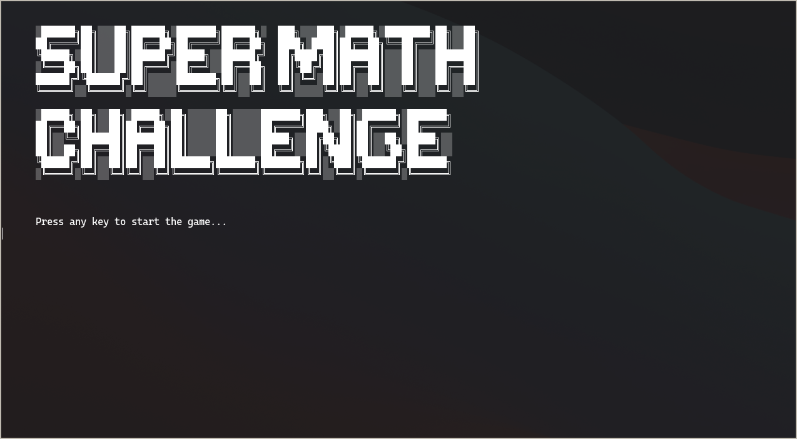

[![MIT License][license-shield]][license-url]
[![LinkedIn][linkedin-shield]][linkedin-url]

<!-- PROJECT LOGO -->
<br />
<h3 align="center">SUPER MATH CHALLENGE</h3>

  <p align="center">
    An awesome two players math game built on Ruby.
    <br />

<!-- ABOUT THE PROJECT -->

## About The Project



Here's a blank template to get started:
**To avoid retyping too much info. Do a search and replace with your text editor for the following:**
`KHNRV`, `super_math_challenge`, `twitter_handle`, `bonjour@kevinnicolas.com`, `SUPER MATH CHALLENGE`, `Want show to your friends who's the math boss? Don't wait any longer! Just fire up your computer, install Ruby, clone this repo, and lunch the game in your terminal. Simple right?`

## Getting Started

To get a local copy up and running follow these simple steps.

### Installation

1. Clone the repo
   ```sh
   git clone https://github.com/KHNRV/super_math_challenge.git
   ```
2. cd into the game's root folder

3. Launch the game
   ```sh
   ruby main.rb
   ```
4. Have fun!

<!-- CONTACT -->

## Contact

Kevin Nicolas - bonjour@kevinnicolas.com

Project Link: [https://github.com/KHNRV/super_math_challenge](https://github.com/KHNRV/super_math_challenge)

<!-- ACKNOWLEDGEMENTS -->

## Acknowledgements

- [Best-README-Template](https://github.com/othneildrew/Best-README-Template)

<!-- MARKDOWN LINKS & IMAGES -->
<!-- https://www.markdownguide.org/basic-syntax/#reference-style-links -->

[contributors-shield]: https://img.shields.io/github/contributors/KHNRV/repo.svg?style=for-the-badge
[contributors-url]: https://github.com/KHNRV/repo/graphs/contributors
[forks-shield]: https://img.shields.io/github/forks/KHNRV/repo.svg?style=for-the-badge
[forks-url]: https://github.com/KHNRV/repo/network/members
[stars-shield]: https://img.shields.io/github/stars/KHNRV/repo.svg?style=for-the-badge
[stars-url]: https://github.com/KHNRV/repo/stargazers
[issues-shield]: https://img.shields.io/github/issues/KHNRV/repo.svg?style=for-the-badge
[issues-url]: https://github.com/KHNRV/repo/issues
[license-shield]: https://img.shields.io/github/license/KHNRV/repo.svg?style=for-the-badge
[license-url]: https://github.com/KHNRV/repo/blob/master/LICENSE.txt
[linkedin-shield]: https://img.shields.io/badge/-LinkedIn-black.svg?style=for-the-badge&logo=linkedin&colorB=555
[linkedin-url]: https://linkedin.com/in/KHNRV
